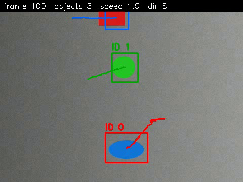
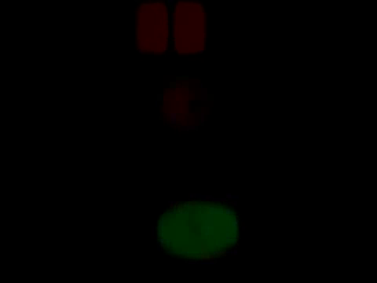
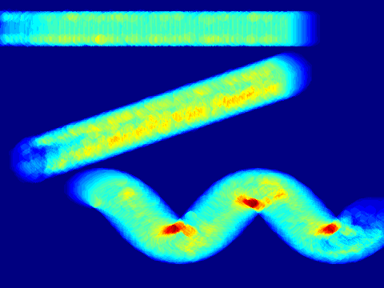
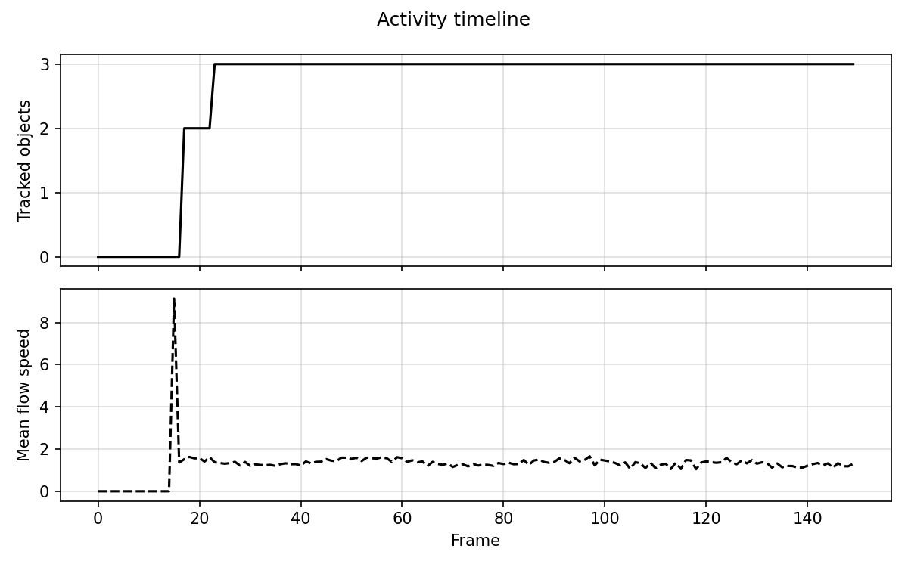

# MotionScope - Motion Detection, Optical Flow and Object Tracking

A command-line Computer Vision project built with Python and OpenCV. It reads a
video from a static camera, finds the moving objects, measures how they move
(optical flow), tracks each one with a persistent ID, and writes reports.

## Overview
| Stage | Technique | File |
|-------|-----------|------|
| 1. Motion detection | MOG2 background subtraction + morphology + contours | `motionscope/detector.py` |
| 2. Optical flow | Farneback dense optical flow | `motionscope/optical_flow.py` |
| 3. Tracking | Centroid tracker (nearest-distance matching) | `motionscope/tracker.py` |
| 4. Analytics | Heatmap, CSV, JSON, timeline chart | `motionscope/analytics.py` |

## Features
- Detects moving objects and draws boxes, IDs and motion trails
- Colour-coded optical-flow video (hue = direction, brightness = speed)
- Per-frame speed and compass direction (N, NE, E ...)
- Per-object report: first/last frame, path length, average speed
- Built-in synthetic demo video: works with **no downloads**
- Input validation, clear error messages and a log file
- 18 unit tests

## Technologies used
Python 3.9+, OpenCV (`opencv-python-headless`), NumPy, Matplotlib, `unittest`, Git.

## Project structure
```
motionscope/
  main.py                 command-line entry point
  requirements.txt
  statement.md            problem statement
  motionscope/            source package
    config.py  logger.py  video_io.py  synthetic.py
    detector.py  optical_flow.py  tracker.py  analytics.py  pipeline.py
  tests/                  unit tests
  docs/                   design diagrams (+ make_diagrams.py)
  sample_output/          example results
```

## Installation and running (step by step)
Works on Windows, macOS and Linux. Open a terminal (Command Prompt / PowerShell
on Windows) and run:

```bash
# 1. Get the code
git clone https://github.com/<your-username>/<repo-name>.git
cd <repo-name>

# 2. (Recommended) create a virtual environment
python -m venv venv
#   Windows:      venv\Scripts\activate
#   macOS/Linux:  source venv/bin/activate

# 3. Install dependencies
pip install -r requirements.txt

# 4. Run the full demo (creates a video, analyses it, writes reports)
python main.py demo
```
On some systems use `python3` and `pip3` instead of `python` and `pip`.

Results appear in the `outputs/` folder:
`annotated.mp4`, `optical_flow.mp4`, `tracks.csv`, `summary.json`,
`heatmap.png`, `timeline.png`, `motionscope.log`.

### Using your own video
```bash
python main.py run --input path/to/video.mp4 --out outputs
```
Optional flags: `--min-area 500` (smallest object in pixels), `--max-distance 80`,
`--max-disappeared 10`, `--warmup 10`, `--max-frames 200`, `--no-flow-video`
(faster), `-v` (verbose log, placed before the command: `python main.py -v run ...`).

Other command: `python main.py generate --out data/demo.mp4` creates only the demo video.

Expected demo result: `Unique objects : 3`.

## Testing
```bash
python -m unittest discover -s tests -v
```
All 18 tests should print `OK`. They cover configuration validation, tracker
logic, detector, optical flow, and a full end-to-end run.

## Design diagrams
See the `docs/` folder: `architecture.png`, `workflow.png`, `usecase.png`,
`class_diagram.png`, `sequence.png`. Regenerate with `python docs/make_diagrams.py`.

## Screenshots
| Tracking | Optical flow |
|---|---|
|  |  |

| Motion heatmap | Activity timeline |
|---|---|
|  |  |

## Limitations
Assumes a static camera; objects that cross or overlap may swap IDs; the tracker
does not know what an object is (no classification).

## Author
<your name>, <your registration number> - VIT, Computer Vision course project.
